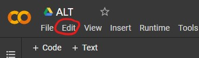
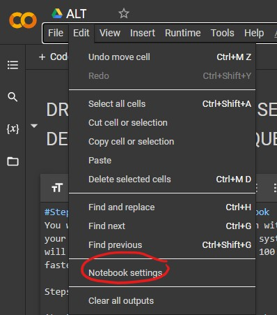
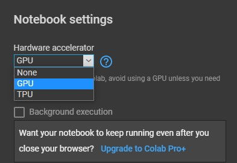
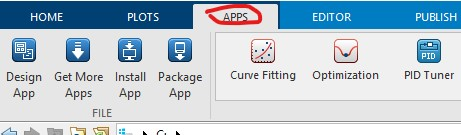
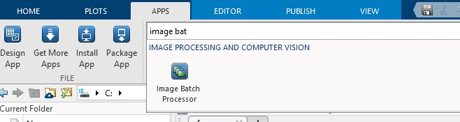
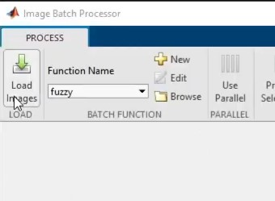
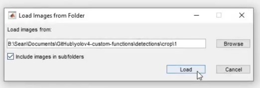
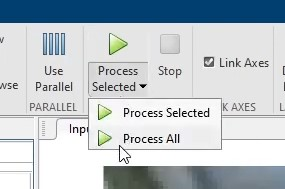
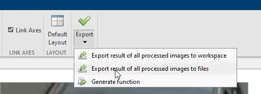
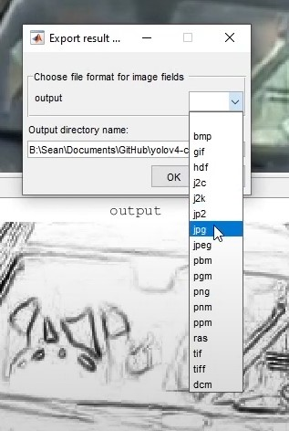

#DRIVER AND PASSENGER SEAT BELT VIOLATION DETECTION USING DEEP LEARNING TECHNIQUES

#Step 1: Enabling GPU within your notebook
You will want to enable GPU acceleration within your Colab notebook so that your YOLOv4 system will be able to process detections over 100 times faster than CPU.

Steps:

i) Click **Edit** at top left of your notebook.

<p align="center"></p>

ii) Click **Notebook Settings** within dropdown.

<p align="center"></p>

iii) Under 'Hardware Accelerator' select **GPU** and then hit **Save**.

<p align="center"></p>

Your notebook should now have GPU enabled!

#Step 2: Cloning and building the repo

The following cells will clone and build the ALT-seatbelt-detection repository.


```python
# clone repo
!git clone https://github.com/spsangeles/ALT-seatbelt-detection
```

The cell below will install the requirements necessary for this runtime.

To install for CPU-only, change it to 'requirements.txt' instead.


```python
# Tensorflow GPU
%cd ALT-seatbelt-detection/
!pip install -r requirements-gpu.txt
```


```python
# This stops 'Run all' at this cell by causing an error
# This is done because some steps need manual attention.
assert False
```

#Step 3: Mounting your Google Drive 
Here is how to mount your Google Drive root folder to this runtime. To be used for easy file transfers.


---


First off, copy the contents of this Google Drive folder to the root of your Google Drive:

https://drive.google.com/drive/folders/1WBFUL8KTRE68EaWigzA_-BRJf2Hbqu8n?usp=sharing

The name of the folder should be **'ALT-data'**.

After, the cells below will mount your Google Drive which will allow for easy file access.


```python
%cd ..
from google.colab import drive
drive.mount('/content/gdrive')
```


```python
# this creates a symbolic link so that now the path /content/gdrive/MyDrive/ is equal to /mydrive
!ln -s /content/gdrive/MyDrive/ /mydrive

```

The !ls command is used here. **'seatbelt.weights'** and **'windshield.weights'** should be visible. If not, you might not have copied the drive linked earlier correctly.


```python
%cd /mydrive/ALT-data
!ls
```

We copy the darknet weights into the cloned repo 'ALT-seatbelt-detection' into the 'data' folder.


```python
!cp seatbelt.weights /content/ALT-seatbelt-detection/data/
!cp windshield.weights /content/ALT-seatbelt-detection/data/
!ls /content/ALT-seatbelt-detection/data/
```


```python
%cd /content/ALT-seatbelt-detection/
!ls
```


```python
# This stops 'Run all' at this cell by causing an error
# This is done because some steps need manual attention.
assert False
```

#Step 4: Converting the darknet weights

To implement YOLOv4 using TensorFlow, we convert the .weights into the corresponding TensorFlow model files and then run the model.


```python
# CONVERT DARKNET SEATBELT AND WINDSHIELD WEIGHTS TO TENSORFLOW
!python changeconfigtoWS.py
!python save_model.py --weights ./data/windshield.weights --output ./checkpoints/yolov4-416-ws --input_size 416 --model yolov4 

!python changeconfigtoSB.py
!python save_model.py --weights ./data/seatbelt.weights --output ./checkpoints/yolov4-416-sb --input_size 416 --model yolov4 
```

#Step 5: Detection of Windshield

*The first phase of detection is the windshield.*

This will copy the images from the Google Drive directory 'ALT-data/' to 'ALT-seatbelt-detection/data/images/'.


```python
%cd ..
%cd /mydrive/ALT-data
!cp -R images /content/ALT-seatbelt-detection/data/
!ls /content/ALT-seatbelt-detection/data/images
```

The cell below will detect windshield from an image that was selected.

Change **'./data/images/a (1).jpg'** to the image you would like to process. By default, it is set to **'a (1).jpg'**.

*Result will be in **'ALT-seatbelt-detection/detections/crop'**.*

**Note**: You can also run the detector on multiple images at once by changing the --images flag like such --images "./data/images/1.jpg, ./data/images/2.jpg"


```python
%cd /content/ALT-seatbelt-detection/
!python changeconfigtoWS.py
!python detect.py --weights ./checkpoints/yolov4-416-ws --size 416 --model yolov4 --images ./data/images/'a (1).jpg' --crop
!echo Finish MATLAB process before continuing
```

MATLAB is needed for the next part. (Step 6)

#Step 6: Running MATLAB

This step requires that you have **MATLAB R2021a** or newer. We will be using a built-in function that can only be run on the app itself.

In the repo directory, there is a folder called 'matlabscript' with a file inside 'fuzzy.m'. Launch **MATLAB** and open this file.

At the top of **MATLAB**, look for the **APPS** toolbar and click it.

<p align="center"></p>

Look up **'Image Batch Processor'** in the search bar and open it.

<p align="center"></p>

Click **'Load images'** and choose the directory where the images processed in **Step 5** are stored.

<p align="center"></p>

<p align="center"></p>

At this point the cropped images should load here. Click the drop down button in **Process** and choose **Process All**. This will use the script and apply fuzzy logic-based edge detection to the image set.

<p align="center"></p>

After, click the drop down button for **Export** and choose **Export result of all processed images to files**, choose a format (.jpg), and choose a directory for the output.

<p align="center"></p>

<p align="center"></p>

You've successfully applied fuzzy logic-based edge detection to the images!

Once done, copy resulting images into the Google Drive directory **'/ALT-data'** in a new folder called **'matlab-result'**.

The cell below will copy the **'matlab-result'** folder from the drive into the repo directory **'content/ALT-seatbelt-detection/data'**.


```python
%cd ..
%cd /mydrive/ALT-data
!cp -R matlab-result /content/ALT-seatbelt-detection/data/
!ls /content/ALT-seatbelt-detection/data/matlab-result
```

#Step 7: Detection of Seat belt

*The second phase of detection is the seat belt.*

The cell below will detect seat belt from an image that was selected.

Change **'./data/matlab-result/windshield_1_output.jpg'** to the image you would like to process. By default, it is set to **'windshield_1_output.jpg'**.

Result will be in **'ALT-seatbelt-detection/detections/crop'**.

**Note**: You can also run the detector on multiple images at once by changing the --images flag like such --images "./data/images/1.jpg, ./data/images/2.jpg"


```python
%cd /content/ALT-seatbelt-detection/
!python changeconfigtoSB.py
!python detect.py --weights ./checkpoints/yolov4-416-sb --size 416 --model yolov4 --images ./data/matlab-result/windshield_1_output.jpg
```

#Thanks!

---

Creators:

Angeles, Sean Paul S.

Libed, Jeremiah Ian Ross S.

Toledo, Kristine Joy T.
